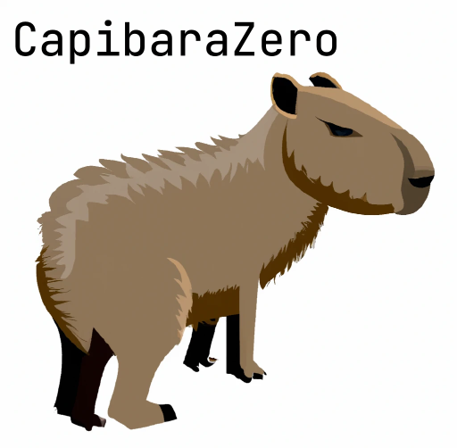

# CapibaraZero

CapibaraZero aim to be a cheap alternative to FlipperZero™. It's based on ESP32 boards especially on ESP32-S3 but we want to port firmware to all ESP family boards.

## Status

The project is BETA! 🎉

Working Features:

- Wi-Fi support
- BLE support
- BadUSB support
- NFC support
- Some network attacks
- SubGHZ(Still in beta status)
- IR

## Social

- [Matrix server](https://matrix.to/#/#capibarazero:capibarazero.com)
- [Discord-Matrix bridge](https://discord.gg/77f3BHvnhf)
- [Docs](https://capibarazero.com)
